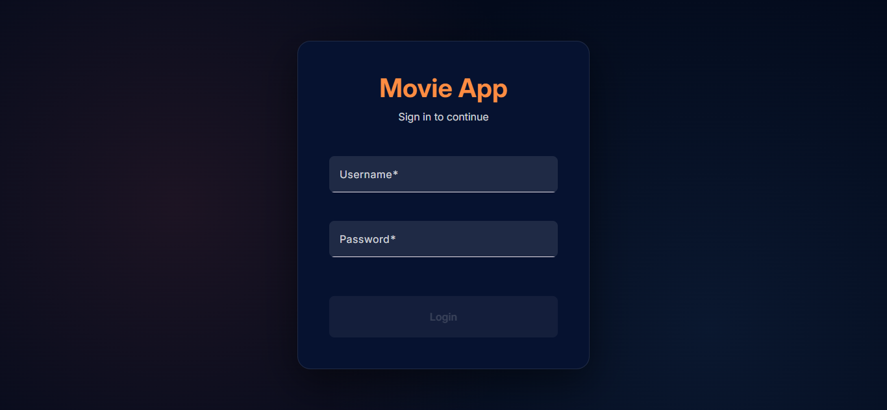
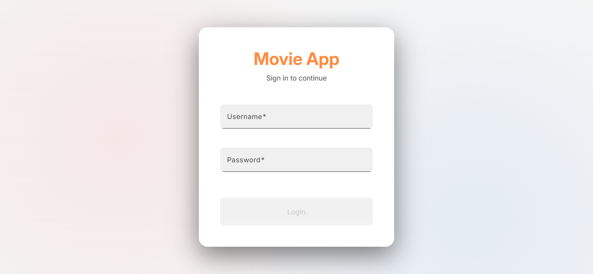
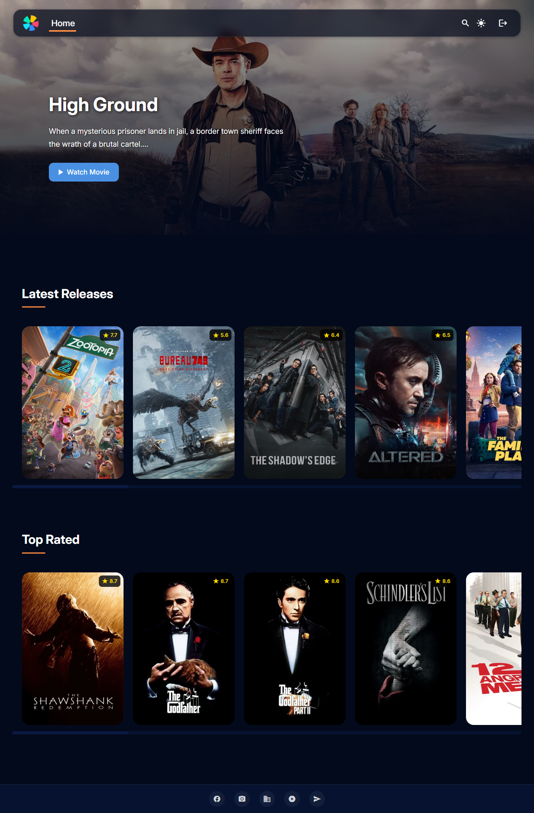
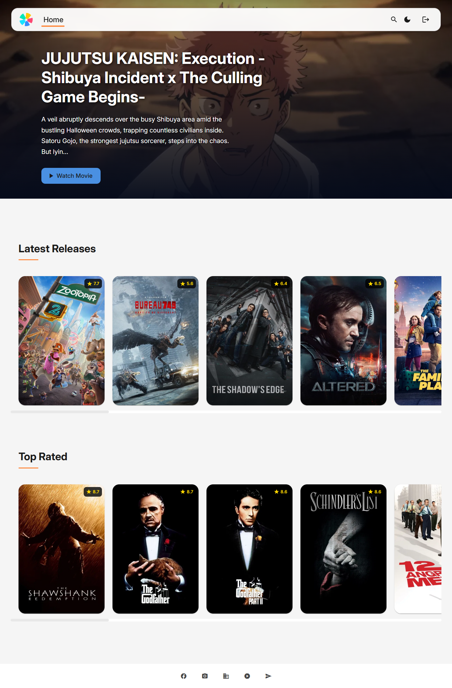
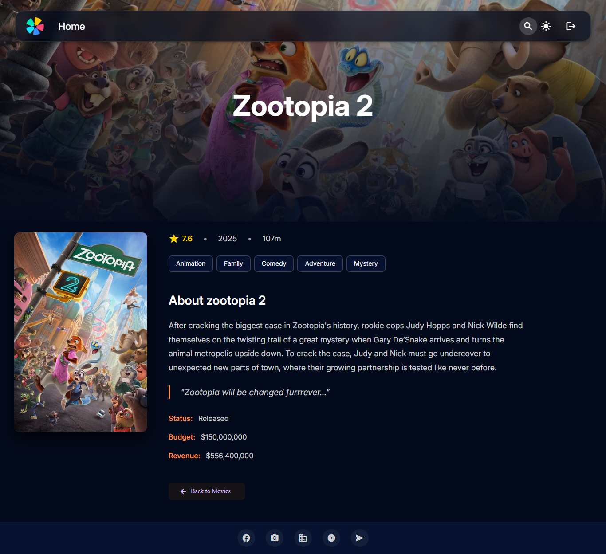
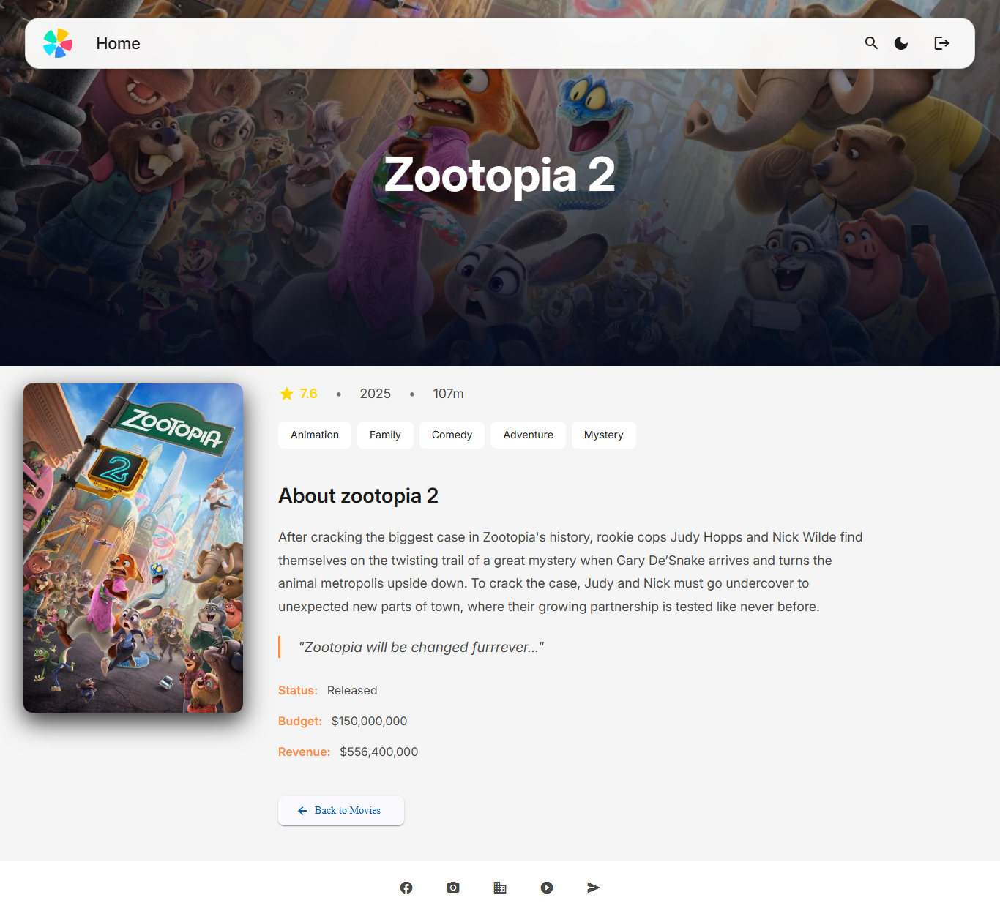
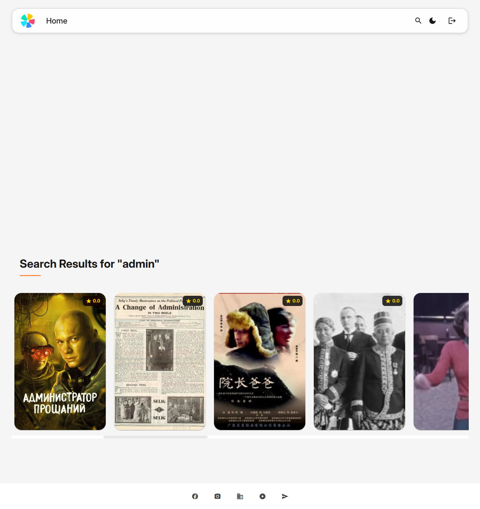
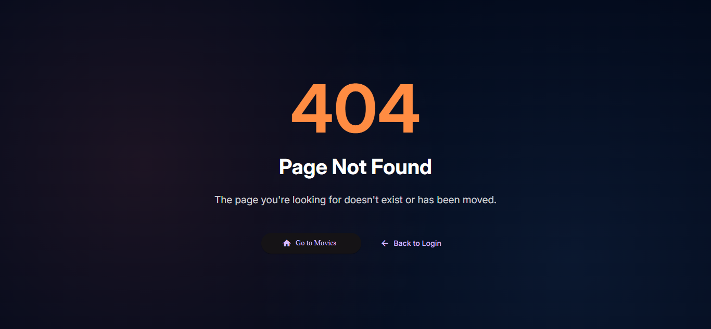

# Angular Movie App

A modern, responsive movie browsing application built with Angular 19, featuring authentication, movie search, and detailed movie information using The Movie Database (TMDb) API. The application includes a beautiful UI with dark/light theme support, lazy-loaded routes, and comprehensive error handling.

This project was generated using [Angular CLI](https://github.com/angular/angular-cli) version 19.2.19.

## Features

- **User Authentication**: Secure login system with token-based authentication
- **Movie Browsing**: Browse popular and top-rated movies with beautiful card layouts
- **Movie Search**: Real-time search functionality with dedicated search results view
- **Movie Details**: Comprehensive movie detail pages with backdrop images, ratings, genres, and metadata
- **Theme Toggle**: Dark and light mode support with smooth transitions
- **Responsive Design**: Fully responsive layout optimized for all screen sizes
- **Error Handling**: Global error handling with user-friendly notifications
- **Loading States**: Global loading indicator for better UX
- **404 Page**: Custom 404 page for invalid routes

## Technologies Used

- **Angular 19** - Modern web framework
- **Angular Material** - UI component library
- **Bootstrap 5** - CSS framework for responsive design
- **RxJS** - Reactive programming library
- **TypeScript** - Typed JavaScript
- **TMDb API** - Movie data source

## Run the Code

To start a local development server, please run:

```bash
npm install
```

Then run:

```bash
ng serve
```

Login Credentials:

```bash
User: admin
Password: admin123
```
Once the server is running, open your browser and navigate to `http://localhost:4200/`.

The application will automatically reload whenever you modify any of the source files.

### Prerequisites

- Node.js (v18 or higher)
- npm (v9 or higher)
- Angular CLI (v19 or higher)

### Environment Setup

The application uses TMDb API for movie data. The API key is already configured in `src/environments/environment.ts`. For production, make sure to:

1. Create your own TMDb API key at [https://www.themoviedb.org/settings/api](https://www.themoviedb.org/settings/api)
2. Update the `tmdbApiKey` in the environment files

## Screenshots

### Login Page


*User authentication interface with form validation*

### Movie List / Dashboard


*Home page showing popular movies with hero banner and movie cards*

### Movie Detail Page


*Comprehensive movie information with backdrop, poster, and metadata*

### Search Results


*Search functionality with filtered movie results*

### 404 Page


*Custom 404 error page for invalid routes*

## Project Structure

I have used the following structure to achieve:
- **Clear separation**: Core services, shared utilities, features, layout
- **Scalability**: Easy to add new features
- **Maintainability**: Easier to locate files
- **Reusability**: Shared components and interfaces

```
src/app/
├── core/                          # Core services, guards, interceptors
│   ├── guards/
│   │   └── auth.guard.ts         # Route guard for authentication
│   ├── interceptors/
│   │   ├── auth-token.interceptor.ts  # Adds auth token to requests
│   │   └── loader.interceptor.ts      # Global loading indicator
│   └── services/
│       ├── auth.service.ts       # Authentication service
│       ├── loader.service.ts     # Loading state management
│       ├── notification.service.ts    # Snackbar notifications
│       └── theme.service.ts      # Theme management (dark/light)
│
├── features/                      # Feature modules/components
│   ├── auth/
│   │   └── login/
│   │       ├── login.component.ts
│   │       ├── login.component.html
│   │       └── login.component.scss
│   ├── movies/
│   │   ├── movie-list/
│   │   │   ├── movie-list.component.ts
│   │   │   ├── movie-list.component.html
│   │   │   └── movie-list.component.scss
│   │   ├── movie-detail/
│   │   │   ├── movie-detail.component.ts
│   │   │   ├── movie-detail.component.html
│   │   │   └── movie-detail.component.scss
│   │   ├── resolvers/
│   │   │   └── movie.resolver.ts  # Pre-fetch movie data
│   │   ├── services/
│   │   │   └── movie.service.ts   # TMDb API integration
│   │   ├── movies.module.ts        # Movies feature module (declares components)
│   │   └── movies-routing.module.ts # Movies routing configuration
│   └── not-found/
│       ├── not-found.component.ts
│       ├── not-found.component.html
│       └── not-found.component.scss
│
├── layout/                        # Layout components
│   ├── header/
│   │   ├── header.component.ts
│   │   ├── header.component.html
│   │   └── header.component.scss
│   ├── footer/
│   │   ├── footer.component.ts
│   │   ├── footer.component.html
│   │   └── footer.component.scss
│   ├── hero-banner/
│   │   ├── hero-banner.component.ts
│   │   ├── hero-banner.component.html
│   │   └── hero-banner.component.scss
│   └── main-layout/
│       ├── main-layout.component.ts
│       ├── main-layout.component.html
│       └── main-layout.component.scss
│
├── shared/                        # Shared components, interfaces
│   ├── components/
│   │   ├── loader/
│   │   │   ├── loader.component.ts
│   │   │   ├── loader.component.html
│   │   │   └── loader.component.scss
│   │   └── movie-card/
│   │       ├── movie-card.component.ts
│   │       ├── movie-card.component.html
│   │       └── movie-card.component.scss
│   └── interfaces/
│       ├── api.interface.ts      # API response types
│       ├── movie.interface.ts    # Movie data types
│       └── user.interface.ts     # User data types
│
├── app.component.ts
├── app.component.html
├── app.component.scss
├── app.config.ts                  # Application configuration
├── app.routes.ts                  # Route definitions
└── app.spec.ts
```

## Data Flow Mind Map

```
                    ANGULAR MOVIE APP - DATA FLOW
                    =================================

┌─────────────────────────────────────────────────────────────────────────────┐
│                           AUTHENTICATION FLOW                               │
└─────────────────────────────────────────────────────────────────────────────┘
                                    │
                    ┌───────────────▼───────────────┐
                    │   LoginComponent              │
                    │   • Form submission           │
                    │   • Credentials validation    │
                    └───────────────┬───────────────┘
                                    │
                                    │ login(credentials)
                                    │
                    ┌───────────────▼───────────────┐
                    │   AuthService                 │
                    │   • Validates credentials     │
                    │   • Generates tokens          │
                    │   • Stores in localStorage    │
                    └───────────────┬───────────────┘
                                    │
                                    │ Token stored
                                    │
                    ┌───────────────▼───────────────┐
                    │   AuthGuard                   │
                    │   • Checks authentication     │
                    │   • Protects routes           │
                    └───────────────┬───────────────┘
                                    │
                                    │ Route access granted
                                    │
                    ┌───────────────▼───────────────┐
                    │   AuthTokenInterceptor        │
                    │   • Adds token to headers     │
                    │   • Handles token refresh     │
                    └───────────────────────────────┘

┌─────────────────────────────────────────────────────────────────────────────┐
│                           MOVIE DATA FLOW                                   │
└─────────────────────────────────────────────────────────────────────────────┘
                                    │
                    ┌───────────────▼───────────────┐
                    │   MovieListComponent          │
                    │   • ngOnInit()                │
                    │   • Loads popular/top-rated   │
                    └───────────────┬───────────────┘
                                    │
                                    │ getPopularMovies()
                                    │ getTopRatedMovies()
                                    │
                    ┌───────────────▼───────────────┐
                    │   MovieService                │
                    │   • HTTP requests             │
                    │   • TMDb API integration      │
                    └───────────────┬───────────────┘
                                    │
                                    │ HTTP Request
                                    │
                    ┌───────────────▼───────────────┐
                    │   LoaderInterceptor           │
                    │   • Shows loading indicator   │
                    │   • Hides on response         │
                    └───────────────┬───────────────┘
                                    │
                                    │ HTTP Request
                                    │
                    ┌───────────────▼───────────────┐
                    │   AuthTokenInterceptor        │
                    │   • Adds auth token           │
                    └───────────────┬───────────────┘
                                    │
                                    │ HTTP Request
                                    │
                    ┌───────────────▼───────────────┐
                    │   TMDb API                    │
                    │   • Returns movie data        │
                    └───────────────┬───────────────┘
                                    │
                                    │ HTTP Response
                                    │
                    ┌───────────────▼───────────────┐
                    │   MovieListComponent          │
                    │   • Updates UI                │
                    │   • Displays movie cards      │
                    └───────────────────────────────┘

┌─────────────────────────────────────────────────────────────────────────────┐
│                             MOVIE DETAIL FLOW                               │
└─────────────────────────────────────────────────────────────────────────────┘
                                    │
                    ┌───────────────▼───────────────┐
                    │   User clicks "View Details"  │
                    │   • Router navigation         │
                    └───────────────┬───────────────┘
                                    │
                                    │ Route: /movies/:id
                                    │
                    ┌───────────────▼───────────────┐
                    │   MovieResolver               │
                    │   • Pre-fetches movie data    │
                    │   • Returns MovieDetail       │
                    └───────────────┬───────────────┘
                                    │
                                    │ Resolved data
                                    │
                    ┌───────────────▼───────────────┐
                    │   MovieDetailComponent        │
                    │   • Displays movie info       │
                    │   • Shows backdrop/poster     │
                    └───────────────────────────────┘

┌─────────────────────────────────────────────────────────────────────────────┐
│                               SEARCH FLOW                                   │
└─────────────────────────────────────────────────────────────────────────────┘
                                    │
                    ┌───────────────▼───────────────┐
                    │   HeaderComponent             │
                    │   • User enters search query  │
                    └───────────────┬───────────────┘
                                    │
                                    │ Navigate with query params
                                    │
                    ┌───────────────▼───────────────┐
                    │   MovieListComponent          │
                    │   • Reads query params        │
                    │   • Calls searchMovies()      │
                    └───────────────┬───────────────┘
                                    │
                                    │ searchMovies(query)
                                    │
                    ┌───────────────▼───────────────┐
                    │   MovieService                │
                    │   • TMDb search API           │
                    └───────────────┬───────────────┘
                                    │
                                    │ Search results
                                    │
                    ┌───────────────▼───────────────┐
                    │   MovieListComponent          │
                    │   • Displays search results   │
                    │   • Shows search banner       │
                    └───────────────────────────────┘

┌─────────────────────────────────────────────────────────────────────────────┐
│                          ERROR HANDLING FLOW                                │
└─────────────────────────────────────────────────────────────────────────────┘
                                    │
                    ┌───────────────▼───────────────┐
                    │   HTTP Error occurs           │
                    │   • API failure               │
                    │   • Network error             │
                    └───────────────┬───────────────┘
                                    │
                                    │ Error caught
                                    │
                    ┌───────────────▼───────────────┐
                    │   Component Error Handler     │
                    │   • Catches error             │
                    └───────────────┬───────────────┘
                                    │
                                    │ showError()
                                    │
                    ┌───────────────▼───────────────┐
                    │   NotificationService         │
                    │   • Shows MatSnackBar         │
                    │   • User-friendly message     │
                    └───────────────────────────────┘

┌─────────────────────────────────────────────────────────────────────────────┐
│                      THEME MANAGEMENT FLOW                                  │
└─────────────────────────────────────────────────────────────────────────────┘
                                    │
                    ┌───────────────▼───────────────┐
                    │   HeaderComponent             │
                    │   • User clicks theme toggle  │
                    └───────────────┬───────────────┘
                                    │
                                    │ toggleTheme()
                                    │
                    ┌───────────────▼───────────────┐
                    │   ThemeService                │
                    │   • Updates signal            │
                    │   • Sets data-theme attribute │
                    │   • Persists to localStorage  │
                    └───────────────┬───────────────┘
                                    │
                                    │ Signal change
                                    │
                    ┌───────────────▼───────────────┐
                    │   CSS Variables               │
                    │   • Theme colors update       │
                    │   • Components re-render      │
                    └───────────────────────────────┘
```

## Key Architectural Patterns

### 1. Component Architecture
The application uses a hybrid approach:
- **Standalone Components**: Most components (header, footer, movie-card, loader, etc.) are standalone, providing better tree-shaking and simpler structure
- **Module-Based Feature**: The movies feature uses NgModule pattern with `MoviesModule`:
  - Declares `MovieListComponent` and `MovieDetailComponent` (with `standalone: false`)
  - Uses `MoviesRoutingModule` with `RouterModule.forChild()` for feature routing
  - Imports standalone components (`MovieCardComponent`, `HeroBannerComponent`) and Angular Material modules
  - This pattern is used when module-based architecture is required

### 2. Lazy Loading
Routes are configured with lazy loading for optimal performance:
- **Feature-based loading**: Movies feature loads only when accessed
- **Code splitting**: Reduces initial bundle size
- **Faster initial load**: Only essential code loads first

### 3. Route Guards
- **AuthGuard**: Protects authenticated routes, redirects to login if not authenticated
- **Route protection**: Ensures only authenticated users access movie pages

### 4. HTTP Interceptors
- **AuthTokenInterceptor**: Automatically adds authentication tokens to HTTP requests
- **LoaderInterceptor**: Shows/hides global loading indicator for all HTTP requests
- **Centralized logic**: Reduces code duplication across services

### 5. Service-Based Architecture
- **Separation of concerns**: Business logic in services, presentation in components
- **Reusability**: Services can be injected into any component
- **Testability**: Services can be easily mocked and tested

### 6. Theme Management
- **Signal-based state**: Uses Angular Signals for reactive theme state
- **CSS custom properties**: Theme variables for easy color management
- **Persistent preferences**: Theme choice saved in localStorage
- **Material theming**: Angular Material themes switch dynamically

### 7. Error Handling
- **Global notifications**: MatSnackBar for user-friendly error messages
- **Centralized service**: NotificationService for consistent error display
- **Graceful degradation**: Application continues to function on errors

### 8. Resolvers
- **Pre-fetching**: MovieResolver loads movie data before component initialization
- **Better UX**: Data available immediately when component loads
- **Error handling**: Invalid movie IDs redirect to 404 page

### 9. Reactive Programming
- **RxJS Observables**: All HTTP calls use Observables
- **Reactive forms**: Login form uses ReactiveFormsModule
- **Signal-based state**: Theme management uses Angular Signals

### 10. Responsive Design
- **Mobile-first approach**: Styles optimized for mobile devices
- **CSS relative units**: Uses `rem` for scalable typography
- **Breakpoint-based layouts**: Media queries for different screen sizes
- **Flexible grid**: Bootstrap grid system for responsive layouts

## CSS Animations & Transitions

The application uses a combination of CSS animations, CSS transitions, and Angular animations to create smooth, engaging user experiences.

### CSS Animations

#### heroFade
- **Location**: `movie-detail.component.scss`
- **Duration**: 1s
- **Easing**: ease-in-out
- **Effect**: Fade and scale animation
- **Usage**: Applied to movie detail backdrop section and poster images on page load
- **Keyframes**:
  ```scss
  from { opacity: 0; transform: scale(1.03); }
  to { opacity: 1; transform: scale(1); }
  ```

#### slideIn
- **Location**: `header.component.scss`
- **Duration**: 0.3s
- **Easing**: ease
- **Effect**: Slide and fade animation
- **Usage**: Search input container when toggled open
- **Keyframes**:
  ```scss
  from { opacity: 0; transform: translateX(20px); }
  to { opacity: 1; transform: translateX(0); }
  ```

### CSS Transitions

The application uses a standardized transition system via CSS custom properties defined in `styles.scss`:

- **--transition-fast**: `0.2s ease` - Quick interactions (button hovers, icon changes)
- **--transition-normal**: `0.3s ease` - Standard transitions (overlays, color changes)
- **--transition-slow**: `0.5s ease` - Smooth, noticeable changes (card transforms, image swaps)

#### Transition Usage Throughout the Application

**Movie Cards** (`movie-card.component.scss`):
- Card hover effects: `transform` and `box-shadow` transitions
- Image swap on hover: `opacity` and `transform` transitions (base to hover image)
- Overlay reveal: `opacity` transition for title and button overlay

**Header** (`header.component.scss`):
- Background color transitions on theme change
- Button hover states with background color transitions
- Search toggle active state transitions

**Hero Banner** (`hero-banner.component.scss`):
- Background image transitions when movie changes
- Overlay gradient transitions

**Buttons** (various components):
- Hover states with `transform` (translateY) and color transitions
- Active states with scale and color changes

**Theme Switching** (`styles.scss`):
- Global `background-color` and `color` transitions for smooth theme changes
- Applied to `body` element for seamless dark/light mode switching

**Form Fields**:
- Focus states with border and background color transitions
- Material form field container transitions

**Movie Detail Page** (`movie-detail.component.scss`):
- Poster image hover scale effect
- Back button hover transitions

### Angular Animations

#### fadeZoom
- **Location**: `hero-banner.component.ts`
- **Type**: Angular Animation Trigger
- **Duration**: 800ms
- **Easing**: ease-in-out
- **Effect**: Fade and zoom animation
- **Usage**: Hero banner movie transitions when featured movie changes
- **Trigger**: Activated by `movie.id` changes in the template
- **Animation Definition**:
  ```typescript
  trigger('fadeZoom', [
    transition('* => *', [
      style({ opacity: 0, transform: 'scale(1.03)' }),
      animate('800ms ease-in-out', style({ opacity: 1, transform: 'scale(1)' }))
    ])
  ])
  ```

### Animation Best Practices

- **Performance**: All animations use CSS transforms and opacity for GPU acceleration
- **Consistency**: Standardized transition durations ensure consistent feel across the application
- **Accessibility**: Animations respect user preferences and don't interfere with content readability
- **Smooth Transitions**: Theme changes use transitions to avoid jarring color switches

## Resources & Helpers

I have used the following resources while completing this project:

### 1. UI Libraries
- [Angular Material](https://material.angular.io/) - Material Design components
- [Bootstrap 5](https://getbootstrap.com/) - CSS framework for responsive design

### 2. API
- [The Movie Database (TMDb) API](https://www.themoviedb.org/documentation/api) - Movie data source
  - Popular movies endpoint
  - Top-rated movies endpoint
  - Movie search endpoint
  - Movie details endpoint

### 3. UI/UX Design Inspiration
- [Figma](https://www.figma.com/design/Kc7alA3GudFDhpNTk3AjDX/Movie---Series-Website--Community-?node-id=1357-5509&t=bbqx7hIIaFypOKl9-0) - Design inspiration for layout, colors, and movie card styles
- [Logoipsum](https://logoipsum.com/) - For the logo
- [Placehold](https://placehold.co/) - For images placeholder

### 4. Icons
- [Material Icons](https://fonts.google.com/icons) - Icon library from Google Fonts

### 5. Typography
- [Google Fonts - Inter](https://fonts.google.com/specimen/Inter) - Primary font family

### 6. Coding & Implementation
I used the following resources to help with implementation:

**Angular Documentation:**
- [Angular Documentation](https://angular.dev/)
- [Angular Material v19 Theming](https://v19.material.angular.dev/guide/theming)
- [Angular Router](https://angular.dev/guide/router)
- [Angular Signals](https://angular.dev/guide/signals)

**Angular Material:**
- [Material Components](https://v19.material.angular.dev/components/categories)
- [Material Theming Guide](https://v19.material.angular.dev/guide/theming#multiple-themes)

**Bootstrap:**
- [Bootstrap Documentation](https://getbootstrap.com/docs/5.3/)

### 7. AI Usage
- **Cursor AI** - My Default Code editor, I used its autocomplete fetaures and AI assistance.
- **Chat GPT** - For troubleshooting specific issues


### 8. Issues & Solutions
- StackOverflow - For troubleshooting specific issues
- Angular GitHub Issues - For framework-related problems
- Material Design Guidelines - For UI/UX best practices

## Building

To build the project run:

```bash
ng build
```

This will compile your project and store the build artifacts in the `dist/` directory. The production build optimizes your application for performance and speed.

